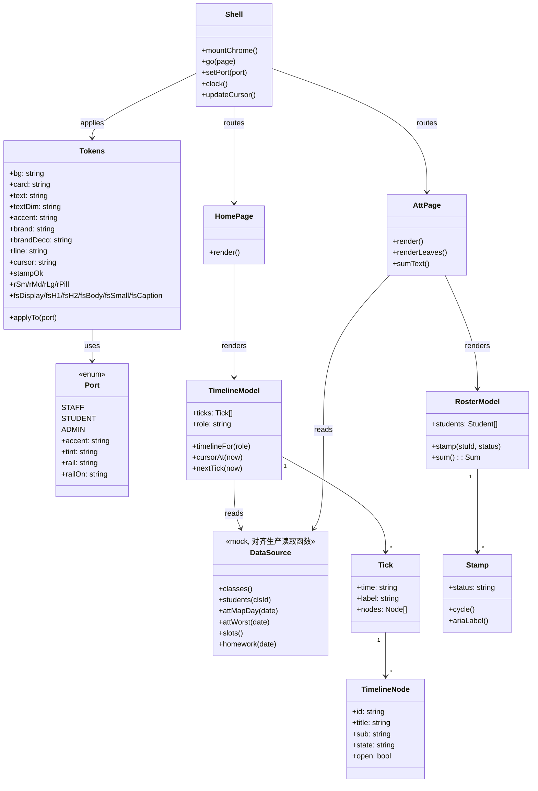
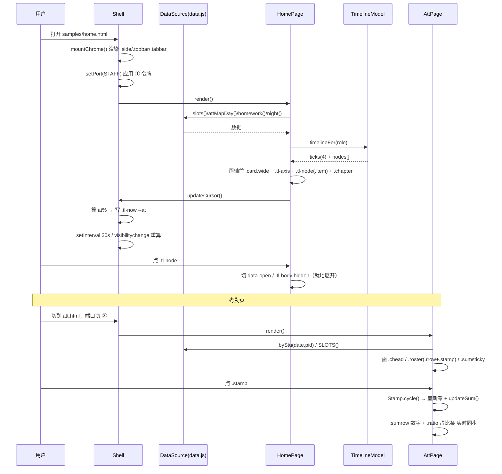

# 砺蕴教务系统 · 视觉升级 · 设计系统规格与 5 页施工图（v1 · 定稿）

> 作者：高见远（架构师）｜2026-10-04
> 性质：**进入实现前的最后一份设计文档**。工程师完全照此施工。
> 上游：`01-PRD-视觉升级方案.md`（第一轮 A/B/C）、`02-第二轮-结构创新方向.md`（D/E/F）、`plates2/D.html`、`plates2/F.html`。
> 只读基线：`index.html`（13284 行）——本文件**未改动任何生产文件**。
> 交付形态：`docs/redesign-2026-10/samples/` 下 5 页独立设计样张 demo（**不动生产 index.html**）。

---

## 0. 定案回执（不可更改，本文只落实、不重议）

| 项 | 定案 | 本文件的落实位置 |
|---|---|---|
| 导航 | 侧栏/顶栏**一律不动**，创新只发生在 `.main` 内容区 | §2 每页「复用类」均含 `.side/.topbar/.tabbar`，无新增 |
| 今日页 | 采用 **D「时序·时间轴」**：轴首 → 主轴 → 节点 → 轴尾 | §2.1 |
| 时间轴泛化 | 一套骨架，节点内容按**角色**变 | §2.1.3 角色映射表 |
| 考勤页 | 采用 **F「册页·内容区重排」**：章节头 + 印章名单 + sticky 小结 + 页尾章节 | §2.2 |
| 配色材质 | **暖金为底 + 借 C 手法**（衬线大标题 / 大留白 / 细线代卡片框）；**圆角保留、适度收敛** | §1.1 / §1.3 |
| 字体 | 思源宋体**标题专用子集 47KB**；动态文字走系统衬线兜底 | §1.2 |
| 端口色 | 6 套 → **3 套**（① 教师/教务 ② 学生 ③ 管理） | §1.4 |
| 本轮不做 | 点阵/一屏全班（E）、深色模式、手机端、看板端 | §0 红线、§6 |
| 本轮范围 | 5 页：今日 / 考勤 / 名册 / 作业 / 设置（教务端） | §2 |
| 交付 | 独立样张 demo，不动生产 index.html | §3 |

**红线（贯穿全程）**
- 🔴 生产目录下 `index.html / sw.js / edge-functions / assets / test` **只读**，一律不改。
- 🔴 不跑 git 提交/推送。
- 🔴 不引入构建工具、不引入 npm 依赖。

---

## 1. 设计系统规格（完整令牌表）

> **融合逻辑一句话**：以第一轮方向 **A（素笺·暖金）** 的令牌表为**唯一基底**（色 / 距 / 圆角 / 阴影的值原样保留），只向 **C** 借四样「手法」——**衬线大标题、大留白、细线代替卡片框、印章角色**；并把 **D** 的 `--cursor`、**F** 的印章四态作为**有依据的增量**并入。圆角**不采用 C 的 0**，收敛 A 的散值到 4 档。

### 1.1 配色（浅色一套完整令牌）

| 令牌 | hex | 用途 | 来源 / 与现状关系 |
|---|---|---|---|
| `--bg` | `#F7F5F0` | 页面底（暖纸） | A 原值；现状 `#f6f5f2` → **略暖**（ΔB=-2） |
| `--card` | `#FFFFFF` | 卡片面 | A 原值；现状同值（保持正白，靠细线/留白去冷感） |
| `--text` | `#26241F` | 正文（墨） | A 原值；现状 `#26241f` 同值（大小写规整） |
| `--text-dim` | `#6E6A61` | 次要文字 | A 原值；现状 `#96918a` → **显著加深**（对比度 ~3.0:1 → **~4.6:1**） |
| `--accent` | `#26241F` | 操作态主色（按钮/选中） | A 原值；现状 `#26241f` 同值 |
| `--btn-text` | `#FFFFFF` | 主色上的字 | A 原值 |
| `--brand` | `#B08A4F` | **可用品牌金**（描边/进度环/大数字衬底） | **A 的「可用金」**；现状 `--gold:#c9ab7c` 加深一档 |
| `--brand-deco` | `#C9AB7C` | **装饰金**（只做点缀，不做操作色） | 现状 `--gold:#c9ab7c` 原样保留，降级用途 |
| `--line` | `#E7E3DA` | 分割线（**唯一的框**） | A 原值；现状 `#e8e6e0` → 略暖略深 |
| `--ok` | `#3F7D5A` | 成功 | A 原值 |
| `--warn` | `#A8611E` | 警示 | A 原值 |
| `--danger` | `#B23A2E` | 危险 | A 原值 |
| `--info` | `#3B6EA5` | 信息（新增，收编散落蓝 `.sc` L1043） | **新增** |
| `--cursor` | `#B0602A` | **游标暖赭**（今日页「现在几点」） | **新增（来自 D §3.5）**；与 `--brand` 区分：金是装饰，赭是「此刻」 |
| `--focus` | `#B0602A` | 焦点环（无障碍，见 §1.8） | **独立取值，不复用 `--cursor`**（第二轮复验 P2-b 回写：`--cursor` 为满足文字 4.5:1 已加深到 `#9C4E1F`；焦点环属「非文字 UI 组件」门槛 3:1，保留 `#B0602A` 实测 4.23–4.61 达标，且与游标色区分更利辨识） |
| `--hover` | `color-mix(in srgb,var(--text) 6%,transparent)` | 悬停底色 | **新增**（替代手写第二套 hex） |
| `--stamp-ok` | `#2F7D5D` | 考勤印章·正常 | 新增（F §5.5；语义色，独立于端口色） |
| `--stamp-late` | `#AA7A1E` | 考勤印章·迟到 | 新增（同上） |
| `--stamp-sick` | `#1B4B5A` | 考勤印章·病假 | 新增（同上，借 C 的深青） |
| `--stamp-leave` | `#B23A2E` | 考勤印章·事假 | 新增（同上） |

> 深色模式：**本轮不做**（用户已裁决）。上表**不提供深色列**，避免实现分心；搬入生产时按 A 版深色表补（`01-PRD` §3 方向 A 已给）。

**从 C 借了什么（借「手法」不借「色」）**

| 借的手法 | 落到哪个令牌 / 哪条规则 | 说明 |
|---|---|---|
| 衬线大标题 | `--font-serif` + `display/h1/h2 三档`（§1.2） | C 的灵魂，本版保留 |
| 大留白 | `--sp-*` 刻度取 A 的宽松档（48/72/112）；章节间 ≥ `--sp-8` | A 已有，向 C 靠拢取宽档 |
| 细线代替卡片框 | **去卡片化章节 `.chapter`**：无 `border`、无 `shadow`，仅 `border-top:1px var(--line)` | 借 C「细线是唯一装饰」 |
| 印章角色 | `.stamp` + `--stamp-*` 四态 | 借 C 的「印章」排版角色（非色相） |

**明确不借 C 的**：C 的骨白底 `#F1ECDE`（改用 A 的 `#F7F5F0`）、C 的 0 圆角（保留圆角）、C 的深青强调色（本版强调色仍是品牌金）。

### 1.2 字体阶梯（6 档）

字体栈（**关键：动态文字必须有系统衬线兜底**）

```css
--font:   -apple-system,"PingFang SC",system-ui,sans-serif;   /* 正文·系统无衬线 */
--font-serif: 'NotoSerifSC','Songti SC','STSong','Source Han Serif SC',serif; /* 标题·宋体 */
--mono:   ui-monospace,"SF Mono",Menlo,Consolas,monospace;   /* 数字/时间/学号 */
```

`@font-face` 写法（子集文件在 `docs/redesign-2026-10/fonts/`）

```css
@font-face{
  font-family:'NotoSerifSC';
  src:url(fonts/NotoSerifSC-Titles-400.woff2) format('woff2');
  font-weight:400;font-style:normal;font-display:block;   /* block：不闪回楷体/宋体二次变字 */
}
@font-face{
  font-family:'NotoSerifSC';
  src:url(fonts/NotoSerifSC-Titles-500.woff2) format('woff2');
  font-weight:500;font-style:normal;font-display:block;
}
```

> **为什么子集够用**：47KB 子集只覆盖**固定 UI 字**（标题、章节名、印章四态、时辰/节次标头）。**动态文字（人名、班级名、作业内容）不在子集里**——它们会沿字体栈落到 `Songti SC / STSong`（系统衬线）渲染。**因此凡是可能装动态文字的宋体元素，字体栈末尾必须是 `serif`，绝不能只写 `'NotoSerifSC'`**，否则缺字会掉到无衬线，观感断层。

| 档 | 字号 | 字重 | 行高 | 字距 | 字体 | 用途 |
|---|---|---|---|---|---|---|
| display | `clamp(38px,4vw,56px)` | 400 | 1.12 | -0.01em | **宋体** | 轴首大数字、版首极大数、页标题 |
| h1 | `26px`（≥1100 时 30px） | 400 | 1.25 | 0 | **宋体** | 页面主标题、章节大标题 |
| h2 | `18px` | 500 | 1.35 | 0 | **宋体** | 卡片标题、章节头、小节头 |
| body | `16px` | 400 | 1.75 | 0 | 系统栈 | 正文、列表项、输入框（**不得 <16px**，防 iOS 缩放） |
| small | `14px` | 400 | 1.6 | 0 | 系统栈 | 次要说明、`.hint` |
| caption | `12px` | 500 | 1.5 | 0.04em | 系统栈 | 标签、`.chip`、印章字、`meta` |

- 数字统一 `font-variant-numeric:tabular-nums`（把现状仅 `.num/.hero`（L293）提到 `.num` 全量 + `.stamp/.clock`）。
- 字重收敛 **400 / 500** 两档（A 版即如此，不引入 600/700；宋体子集只制了 400/500）。

### 1.3 间距刻度 · 圆角分档 · 阴影分档 · 动效令牌

**间距（4px 基准，取 A 的宽松档）**：`--sp-1:4 / --sp-2:8 / --sp-3:12 / --sp-4:16 / --sp-6:24 / --sp-8:32 / --sp-12:48 / --sp-18:72 / --sp-28:112`
- 卡片内边距 `--pad`：`<700` → 20px ｜ `700–1099` → 24px ｜ `≥1100` → 32px（用 `clamp()`，不再靠媒体查询改 `:root`）。
- 区块间距 `--block`：段落 48 → 章节 72 → 轴尾 112。
- **删掉现状的负 margin 补丁**（`.pick.on{margin-left:-10px}` L346、`.page-sub{margin-top:-6px}` L277），改用 `gap` 正间距（**这是本版对现状的一处结构修订**）。

**圆角（现状 5 散值 → 收敛 4 档）**

| 档 | 值 | 用在哪 | 由现状哪个值收敛而来 |
|---|---|---|---|
| `--r-sm` | `8px` | `.chip`、印章、内联小控件、输入框 | `calc(--radius-6px)=8`、`calc(--radius-5px)=9` |
| `--r-md` | `12px` | `.card`、`.btn`、`.banner` | 现状 12（L928）、14（L81） |
| `--r-lg` | `16px` | 大面：轴首卡、开屏板、一次性大容器 | 现状 16（L447/795） |
| `--r-pill` | `999px` | 标签栏、toast、tier 徽章 | — |

**为什么是「4 档」而不是照搬 C 的 0**：本版材质语言仍走 A——暖金 + 细线 + 圆角（现状手机卡片即「金线 + 16px 圆角」，L447-451）；归零等于换成 C 的硬边册页语言，与「暖金为底」冲突。故**圆角保留，只把 5 个散值收敛到语义化的 3 + pill**，`--radius:14px`（L81）这个「卡片专用基准值」**退役**，`24px`（手机标签栏第三套，L459）**并入 `--r-lg/pill`**。

**阴影（2 档，桌面策略显式化）**

| 档 | 值 | 用在哪 |
|---|---|---|
| `--sh-1`（静置） | `0 1px 2px rgba(60,50,35,.05)` | 手机卡片、浮层底座 |
| `--sh-2`（浮起） | `0 6px 18px rgba(60,50,35,.08)` | 悬停、抽屉、`.card:focus-within` |
| **桌面策略** | 一律 `1px var(--line)` 细线，**不用投影**（沿用现状 L928 的做法，写进规范） | ≥700px 全部卡片 |

**动效令牌**

| 档 | 时长 | 缓动 | 场景 |
|---|---|---|---|
| `--dur-quick` | 120ms | `cubic-bezier(.4,0,.2,1)` | 印章盖章、勾选、按钮按下 |
| `--dur-base` | 180ms | `cubic-bezier(.4,0,.2,1)` | 悬停、边框色、chip/折叠切换 |
| `--dur-slow` | 280ms | `cubic-bezier(0,0,.2,1)` | 章节/列表项淡入 |
| `--dur-page` | 420ms | `cubic-bezier(.22,1,.36,1)` | 页面/折叠展开 |

- 收窄现状的 `transition:all`（L383）→ 只动 `transform / opacity / border-color / background-color / color`。
- 只动合成属性；`prefers-reduced-motion` 一律关（§1.8）。

### 1.4 端口色：6 套 → 3 套

**① 教师·教务 ｜ ② 学生 ｜ ③ 管理**

| 端口 | 组内角色 | `--accent` | `--btn-text` | `--brand` | `--tint` | `--rail` | `--rail-on` | `--rail-text` | `--rail-on-text` |
|---|---|---|---|---|---|---|---|---|---|
| **① 教师·教务** | `teacher` `admin` `both` | `#26241F` 墨 | `#FFFFFF` | `#B08A4F` | `#F7F5F0` | `#F3EDE4` | `#E7E0D3` | `#4A463E` | `#26241F` |
| **② 学生** | `student` | `#2E8168` 青绿 | `#FFFFFF` | `#B08A4F` | `#F3FAF6` | `#E2F1EB` | `#CDE7DC` | `#3E6C59` | `#2F4F41` |
| **③ 管理** | `super` `office` | `#A8873F` 暖金 | `#2A2113` | `#7A5E28` | `#FBF6EA` | `#F3ECDD` | `#EADFC6` | `#726445` | `#4D432E` |

**从现有 6 套 → 3 套 的映射对照表**

| 现有端口（现状 accent / 挂载类） | 现状取值 | 归入 | 处置 |
|---|---|---|---|
| 默认（无 role 类） | 墨 `#26241f` | **①** | 作为 ① 基底，`--accent` 原样 |
| `body.role-teacher`（授课端） | 赤 `#CB8671` | **①** | 取消独立端口色；赤色退役 |
| `body.role-admin`（教务端） | 蓝 `#719BCB` | **①** | 取消独立端口色；蓝色退役 |
| `body.role-both`（兼岗端） | 青 `#67A197` | **①** | 取消独立端口色；青色退役 |
| `body.role-super`（首位教务） | 金 `#CBB071` | **③** | 加深为可用金 `#A8873F`（白字对比不足，改深字 `#2A2113`） |
| `body.stu`（学生端） | 青绿 `#71CBA6` | **②** | 加深两档 → `#2E8168`（保证白字 ≥4.5:1） |
| `office`（总教务） | **现状走 `role-admin` 皮肤**（L4207 `rk==='admin'||rk==='office'`，蓝） | **③** | ⚠️ **行为改动**：搬入生产时须把 L4207 的 `office` 从 `role-admin` 改判到 `role-super`（③），否则总教会仍显蓝 |

> ⚠️ **这一条是「端口收敛」唯一的行为改动，务必在任务里点名**（见 §6 风险 1）。①②③ 组内**不再有色差**——同组角色靠内容/权限区分，不靠颜色（这是收敛的既定代价）。

**端口在页面上的三个使用面**（沿用现状语义，L87-101）：`--tint`（次级面：顶栏、内容区底）｜`--rail / --rail-on / --rail-text`（主色面：电脑侧栏、手机标签栏；本次**侧栏结构不动，只换取值**）｜`--rail-art`（侧栏白描线色，保持）。

### 1.5 断点方案（归并 7 档 → 3 档，**统一到 700px**）

| 档 | 区间 | 侧栏 | 内容区 | 依据 |
|---|---|---|---|---|
| 手机 | `< 700` | 隐藏，顶栏 + 底部标签栏 | 单列，`--pad` 20px，左右 16px | 现状默认骨架（L397-441） |
| **平板·窄窗** | `700 – 1099` | 显示 200px（L917） | `.split` **横置**（左列表 + 右详情），`.page.on` 仍单列 | **统一线 = 700** |
| 桌面 | `1100 – 1599` | 显示 236px（L951） | `.page.on` **两列网格**，`--pad` 32px | 现状 L949-967 |
| 宽屏 | `≥ 1600` | 236px | 内容限宽 1400 居中 | 现状 L994（1400→1600） |

**归并说明与「统一到 700px」的裁决理由**：现状断点 699/700、820、900、1100、1400、1700 共 7 档，其中 `700`（侧栏出）与 `820`（`.split` 横置）之间有 **120px 死区**（侧栏已出但内容还竖堆，PRD 诊断 S4）。本轮**把「侧栏出现」与「`.split` 横置」合并到同一条 700px 线**：一过 700 就同时出侧栏、同时横置分栏，消灭死区；桌面两列网格线仍保留在 1100（700 宽放两列会挤）；宽屏限宽线从 1700 上移到 1600（现状 1400-1700 之间那段纯留白过宽）。**`820/900/1400/1700` 四档全部退役。**

### 1.6 阴影 / 层级（surface ladder 轻量化）

不照搬 Linear 的 4 层，只保留 A 的 2 档 + 一条桌面策略：
- 底（`--bg`）→ 面（`--card`，1px `--line`）→ 浮（`--sh-2`）。
- **同一页里「一张卡和另一张卡看起来一样重要」是现状最大问题（PRD H2）** → 本版用**去卡片化**解决：主叙事用 `.chapter`（无框、细线分隔），只有「需要抬起来的东西」（筛选/输入/浮层）才用 `.card`。**级别靠「有没有框」表达，不靠新颜色。**

### 1.7 无障碍规范

```css
/* 焦点环：高对比双色环（学 GOV.UK），键盘可见 */
:focus-visible{ outline:2px solid var(--focus); outline-offset:2px; border-radius:var(--r-sm); }
/* 深色/深底上焦点环改用亮色 */
[data-theme="dark"] :focus-visible{ outline-color:#F2C99A; }
```

- **对比度下限**：正文 ≥ 4.5:1（目标 7:1）；次要文字 ≥ 4.5:1（`--text-dim` 已由 ~3.0 提升到 ~4.6）；大字（≥24px 或 ≥18.66px 粗体）≥ 3:1；UI 组件边界 ≥ 3:1。**验收工具：浏览器 DevTools 对比度检查器，逐页截图比对。**
- **`prefers-reduced-motion` 兜底**（沿用现状 L388，不许删）：所有 `animation/transition` 时长归 0.01ms；**额外**——今日页游标**去掉过渡**（直接跳到位置）、印章**去掉盖章闪动**、`scroll-behavior:auto`。
- 今日页时间轴：`<ol class="tl-axis" role="list">`，游标 `aria-hidden="true"`，另配一条 `.sr-only` 的实时文本「现在 14:52」供读屏；节点按钮用 `<button>` 原生可达。
- 印章按钮 `aria-label="<姓名> 当前状态 <态>，点击修改"`（F 稿已如此，保留）。

### 1.8 「与现状的差异清单」（令牌值变化一览）

| 令牌 | 现状值（行号） | 本版值 | 变化 |
|---|---|---|---|
| `--bg` | `#f6f5f2`（L74） | `#F7F5F0` | 略暖 |
| `--text-dim` | `#96918a`（L78） | `#6E6A61` | **显著加深**（对比度 3.0→4.6） |
| `--line` | `#e8e6e0`（L84） | `#E7E3DA` | 略暖略深 |
| `--accent` | `#26241f`（L79） | `#26241F` | 同值规整 |
| `--gold` | `#c9ab7c`（L85） | **拆两档**：`--brand:#B08A4F` + `--brand-deco:#C9AB7C` | **拆分 + 可用金加深一档** |
| `--radius` | `14px`（L81） | **退役** → `--r-sm/md/lg/pill` | 5 散值收敛 4 档 |
| `--shadow` | `0 1px 4px rgba(60,50,35,.07)`（L82） | `--sh-1`+`--sh-2` | 拆 2 档 |
| `--fs-hero` | `40px`（L105，跳 48/56） | `display` `clamp(38px,4vw,56px)` | 流体化，少断点 |
| `--fs-title` | `22px`（L106，跳 26/30） | `h1` `26px`（≥1100 30px，宋体） | +衬线 |
| `--fs-body` | `16px`（L107） | `16px` | 不变 |
| `--fs-meta` | `13px`（L108） | `small 14px` + `caption 12px` | **13 上调 14，新增 12** |
| `--pad` | `18px`（L110） | 20/24/32（`clamp`） | 刻度化 |
| `--gap` | `12px`（L111） | 12/16/24 | 刻度化 |
| `--dur` | `.18s` 一档（L114） | 4 档 120/180/280/420 | +3 档 |
| `--ease` | 1 条曲线（L113） | 4 条曲线 | +3 条 |
| 字重体系 | 实际 400/500 | 规范 400/500 | 收敛（不引 600/700） |
| 焦点环 | `input:focus` 仅改边框色（L306） | `:focus-visible` 高对比双色环 | **新增，无障碍硬要求** |
| `transition` | `transition:all`（L383） | 收窄为具体属性 | 性能/意外补间 |
| 端口 | 6 套（L582-795） | 3 套（§1.4） | 收敛，office 归属改动 |
| 断点 | 7 档（699/700/820/900/1100/1400/1700） | 3 档（700/1100/1600） | 归并 |
| 新增令牌 | — | `--cursor` `--info` `--focus` `--hover` `--stamp-*` `--font-serif` | 有据增量 |

---

## 2. 5 页的结构规格（逐页施工图）

> **跨页共同约定**：所有页面都挂在现有骨架上（`.app > .side + .col > .topbar + .main > .page`），**复用** `.main / .page / .card / .card.wide / .item / .grow / .split / .pane-list / .pane-main / .chip / .btn / .btn.ghost / .row / .hint / .empty / .num / .hero / .pick / .box / .page-title / .page-sub / .clock`。**新增类只「加在新结构上」，不改旧类语义**，命名规范见 §3.4。

### 2.1 今日页 `#page-home`（D · 时序·时间轴）

**① 复用现有 DOM/类**
`.main`、`.page#page-home`、`.page-title`、`.page-sub`、`.clock`、`.card`、`.card.wide`、`.hero`、`.num`、`.unit`、`.hint`、`.item`、`.item .grow`、`.chip`、`.btn`、`.btn.ghost`、`.row`、`.empty`
（现状 L1649-1673 的 hero 卡 / 新闻卡 / 速览卡三张 `div.card` 的**承载结构保留**，内部重排）

**② 新增类**
`.tl`（时间轴局部根）｜`.tl-head`（轴首）｜`.tl-big`（轴首大数字，`display` 档）｜`.tl-wrap`（主轴定位容器，`position:relative`）｜`.tl-axis`（主轴 `<ol>`）｜`.tl-tick`（刻度 `<li>`，含 `is-past/is-now/is-future`）｜`.tl-mark`（刻度点）｜`.tl-label`（刻度标签）｜`.tl-nodes`（该刻度下的节点容器）｜`.tl-node`（**节点本体，复用 `.item` 作为基类**：`class="item tl-node"`）｜`.tl-body`（节点就地展开体）｜`.tl-now`（**游标**）｜`.chapter`（轴尾去卡片化章节，**跨页共享**）

**③ 分区与视线动线**
```
轴首（.card.wide.tl-head）
  └ 大数字（.tl-big：127 天，display 宋体） + 目标日一行 + 「距下一节 X 分钟」
主轴（.tl-wrap）
  ├ 游标 .tl-now（绝对定位，压在当前时刻）
  └ .tl-axis > 4 个 .tl-tick（07:00 早自习 / 08:30 上午 / 13:30 下午 / 18:30 晚自习）
        └ 每刻度下 N 个 .tl-node（复用 .item），点开 → .tl-body
轴尾（.chapter）
  └ 今日要闻（去卡片化，细线分隔，一行标题）
```
**动线**：眼睛从轴首大数字 → 沿游标向下 → **停在游标下方第一条未完成节点**（=「现在该干什么」）。

**④ 数据来源**（指向具体读取函数）

| 区块 | 来源 | 行号 |
|---|---|---|
| 轴首倒计时天数 | `Home.render` 内 `Math.ceil((date - today)/864e5)` | L4400-4403 |
| 「距下一节」 | 由刻度时间与本地时钟算（新增纯函数，见 §2.1.5） | — |
| 打卡窗口节点 | `Store.list('att:'+t)` 聚合（现速览用） | L4408-4416 |
| 晚自习节点 | `Store.list('night:'+t)`，`st==='过'` 计数 | L4417-4418 |
| 作业节点 | `Store.list('homework').filter(h=>h.date===t)` | L4419 |
| 要闻 | `News.render()` | L4430 |

**⑤ 与现状的差异**：现状 = hero 卡（含**常驻可编辑输入框** L1655-1659）+ 新闻卡 + 速览卡三张竖堆。本版 = **轴首**（去常驻编辑框，改就地编辑）+ **主轴**（把速览 4 项「挂到轴上」）+ **轴尾**（新闻降级为一栏）。删掉速览卡的 `.item` 四行（L4420-4424），内容改写为轴节点。

**⑥ 空态/异常态**
- 无倒计时日期 → 轴首大数字位显示 `.empty`「还没定日期，点这里设置」；主轴照常显示刻度（不塌）。
- 某刻度无任何节点 → 该刻度下显示细一行 `.hint`「本节无事项」，**刻度不删**（时间轴骨架恒定）。
- 无要闻 → 轴尾 `.chapter` 显示 `.empty`。

#### 2.1.1 时间轴三层结构用现有 DOM 的表达（关键契约）

```html
<section class="page" id="page-home">
  <div class="page-title">今日 <span class="clock" id="ckHome"></span></div>

  <!-- 轴首：复用 .card.wide + .hero -->
  <div class="card wide tl-head">
    <div class="hero tl-big"><span class="num">127</span><span class="unit">天</span></div>
    <p class="hint">距统考 · 目标日 2027-02-08</p>
  </div>

  <!-- 主轴：ol 语义 + 游标 -->
  <div class="tl-wrap">
    <div class="tl-now" aria-hidden="true" style="--at:42%"><span class="num">现在 14:52</span></div>
    <ol class="tl-axis" role="list">
      <li class="tl-tick is-past">
        <span class="tl-mark"></span>
        <div class="tl-label"><span class="num">07:00</span> 早自习</div>
        <div class="tl-nodes">
          <!-- 节点 = 复用 .item -->
          <button class="item tl-node" type="button" data-open="0" aria-expanded="false">
            <span class="grow">上午打卡窗口 <span class="hint">07:00–07:30</span></span>
            <span class="chip">未开始</span>
          </button>
          <div class="tl-body" hidden>全班 42 人 · 已点名 · 迟到 1 人</div>
        </div>
      </li>
      <!-- … 08:30 上午 / 13:30 下午(.is-now) / 18:30 晚自习 … -->
    </ol>
  </div>

  <!-- 轴尾：去卡片化章节 -->
  <section class="chapter" aria-label="今日要闻">
    <h2>今日要闻</h2>
    <div class="news-strip"><a href="#" onclick="return false"><span class="num">07:12</span> 国内多家博物馆推出夜间开放…</a></div>
  </section>
</section>
```

> **复用点**：轴首的**大数字直接用现成的 `.hero/.num/.unit`**（L292-295，无需新类）；**节点直接是 `.item`**（L330-332 的 flex + `.grow` 全部生效）；刻度、游标、章节才是真正的新结构。

#### 2.1.2 角色 → 节点集合 的映射机制（时间轴泛化核心）

**机制**：时间轴骨架（轴首 + 4 刻度 + 游标 + 轴尾）**恒定**；只有「每个刻度下挂哪些节点」随角色变。`data.js` 暴露一张纯数据映射 + 一个选择函数：

```js
// data.js（演示数据；对齐生产的 Auth.role() 与各读取函数）
const TICKS = [ '07:00 早自习', '08:30 上午', '13:30 下午', '18:30 晚自习' ];
const TIMELINE_BY_ROLE = { teacher: {...}, admin: {...}, super: {...} };
function timelineFor(role){ return TIMELINE_BY_ROLE[role] || TIMELINE_BY_ROLE.admin; }
```

渲染时，`Home.render()` 取当前角色（demo 里由顶部端口切换器给 `role`），把 `timelineFor(role)` 里每个刻度的节点数组遍历成 `.tl-node`。**骨架代码不因角色而分叉，只喂不同数据。**

**「角色 → 节点集合」映射表（≥3 类）**

| 刻度 | **教师端** `teacher`（只有我带的班） | **教务端** `admin`（全校，本轮 5 页主场景） | **管理端** `super`（全校 + 系统） |
|---|---|---|---|
| 07:00 早自习 | 我带的班·早打卡窗口（应登记班级） | 全校·早打卡窗口（**未登记班级数**） | 全校早打卡 + **教师到岗巡检** |
| 08:30 上午 | 我的课（第 1–2 节，课表 `schedule`）+ 我班的作业检查 | 各班课程概览 + 作业布置覆盖几个班 | 各班课程 + **授课巡检** |
| 13:30 下午 | 我的课（第 3–4 节）+ 我班的下午打卡 | 全校下午打卡（异常 N）+ **待批请假 M** | 全校下午打卡 + 待批请假 + **系统健康** |
| 18:30 晚自习 | 我带的班·晚自习过关 | 全校晚自习过关 + 今日要闻 | 全校晚自习汇总 + **巡检汇总** |
| 轴首副信息 | 「距我的下一节课 X 分钟」 | 「距下一节 X 分钟」 | 「距下一节 X 分钟」+「本周巡检 N 次」 |

> 映射表落在 `data.js` 的一个对象里（键 = 角色，值 = 4 刻度 × 节点数组）。**教师端节点天然是教务端的子集**——泛化靠「同一骨架喂不同节点」，不靠两套版式。

#### 2.1.3 游标（当前时刻）计算与「随分钟走」

- **一天可见区间** `[DAY_START, DAY_END]` 取刻度首尾：`07:00 → 22:00`（**待确认，见 §6 风险 3**，应取自 `schedule` 真实作息）。
- **位置**：`at% = clamp((nowMin - DAY_START) / (DAY_END - DAY_START), 0, 1) * 100`，写进 `.tl-now` 的 `--at`；CSS `.tl-now{position:absolute; top:var(--at); transition:top var(--dur-base)}`（`reduced-motion` 下无过渡）。
- **随分钟走**：复用现状的秒级时钟（`tick()` L... 页面已有 `data-clock`），**只在「分钟变了」时**重算 `--at` 与游标标签（避免每秒写样式）；另用 `visibilitychange` 在切回前台时补算一次。当前刻度加 `.is-now`、其上方加 `.is-past`、下方 `.is-future`。
- **距下一节**：在刻度时间数组里找第一个 `> now` 的刻度，`nextMin - nowMin`。

#### 2.1.4 节点就地展开

`.tl-node[data-open="0|1"]` + `.tl-body[hidden]`：点节点切 `data-open` 与 `hidden`，`.tl-body` 用 `--dur-page` 展开。打卡窗口节点点开 = 内嵌 mini 名单或跳考勤（demo 内做就地提示）；作业节点点开 = 就地勾选（复用 `.box`/`.item.done`，L334-341）。

### 2.2 考勤页 `#page-att`（F · 册页·内容区重排）

**① 复用现有 DOM/类**
`.main`、`.page#page-att`、`.card`、`.card.wide`、`.item`、`.item .grow`、`.chip`、`.chip-on`、`.row`、`.hint`、`.empty`、`.btn`、`.btn.ghost`、`.pre`
（现状 L1763-1815：筛选条 + `#attBody` 长列表 + 两张常驻卡 + `#attSum`）

**② 新增类**
`.chead`（**章节头**：班级 + 日期 + 时段一行宋体大标题）｜`.fold`（筛选折叠按钮，收进章节头右侧）｜`.roster`（印章名单容器，`role="list"`）｜`.rrow`（名单行，可用 `.item` 派生）｜`.idx`（序号，`.num`）｜`.who`（姓名）｜`.stamp`（**印章**，`data-s` = 态；三态：正常/迟到/病假/事假）｜`.sumsticky`（**右侧 sticky 小结容器**）｜`.sumbox`（小结盒）｜`.sumrow`（小结行）｜`.ratio`（占比条）｜`.legend`（图例）｜`.chapter`（页尾章节，复用 §2.1）

**③ 分区与视线动线**
```
章节头 .chead ：宋体「播音一班 · 今日考勤」+ 日期/时段/人数 + 筛选 .fold + 一键全部正常/导出
双栏：
  ├ 左 .roster ：每人一行 .rrow（序号 + 姓名 + 时段点 + 印章 .stamp），点印章改状态并盖新章
  └ 右 .sumsticky（sticky）：.sumbox 本节小结（应到/实到/异常/未登记 + .ratio 占比条）+ 待批请假
页尾 .chapter ：附·请假与导出（去卡片化，原两张常驻卡收拢于此）
```
**动线**：从章节头（一眼确认「给谁点名」）→ 沿名单逐人盖印 → 目光随时右上抬到 sticky 小结看数字。

**④ 数据来源**

| 区块 | 来源 | 行号 |
|---|---|---|
| 时段列表 | `Att.SLOTS()` | L5007 |
| 某班某时段状态 | `Att.byStu(date,pid)` / `Att.mapDay(date)` | L5034 / L5040 |
| 「最重状态」 | `Att.worst(date)` + `Att.RANK` | L5048 / L5000 |
| 名单渲染 | `Att.render()` 的 `students.map`（现 `.item + 4 chip`） | L5085-5102 |
| 小结 | `Att.sumText(date,pid,students,map)` | L5168 |
| 请假待批 | `Att.renderLeaves()` / `Coop.leave` | L5110 / L5136 |
| 一键全部正常 | `Att.allNormal()` | L1777 |

**⑤ 与现状的差异**：现状 = 独立筛选行（L1765-1773）+ 每人一行 **4 个 chip**（L5095-5101）+ 页底纯文字 `#attSum`（L5104）+ 两张常驻卡。本版 = 筛选收进**章节头**、`chip` 组换成**印章**、纯文字汇总换成**右侧 sticky 小结 + 占比条**、常驻卡降为**页尾章节**。**注意**：`--stamp-*` 是**语义色，独立于端口色**（换端口不变）。

**⑥ 空态/异常态**
- 无班级 → `.roster` 显示 `.empty`「先去『名册』建班级和学员」（沿用 L5076 文案）。
- 班级无学员 → `.empty`「这个班还没有学员」（L5102）。
- 未登记学生 → 印章显示 `data-s="none"`（虚描边灰章）。
- 「全部时段」只读模式（L5087-5092）→ 印章置为 `aria-disabled`、点击不生效，保留只读语义。

### 2.3 名册页 `#page-roster`（`.split` 册页化）

**① 复用**：`.main`、`.page#page-roster`、`.split`、`.pane-list`、`.pane-main`、`.card`、`.card.wide`、`.item`、`.pick`、`.pick.on`、`.grow`、`.row`、`.chip`、`.btn`、`.empty`、`.page-title`
**② 新增**：`.chapter`（段标题）、`.cls-count`（班级人数徽记，复用 `.chip` 视觉）、`.split` 的册页化间距
**③ 分区/动线**：左 `.pane-list`（班级列表，`.pick` 选中 `.on`）→ 右 `.pane-main`（当前班学员 `.item` 列表 + 建号卡）。视线：左选班 → 右看人。
**④ 数据来源**：`Roster.render`（L1677 附近）、`Store.list('classes')`、`Store.list('students')`、`Util.fillCls`、`Util.byName`、`Roster.pickCls`（L1689）、`Roster.addClass/addStudent/genAccounts/createSingle`。
**⑤ 与现状差异**：现状是两张 `.card`（班级 / 学员）竖堆 + 单独建号卡 + 批量建号卡 + 周末班卡（L1679-1738）。本版把「班级 / 学员」合并进 **`.split`**（左班右人），建号卡收进右栏，**周末班等次级卡收进「更多」折叠**。
**⑥ 空态**：无班级 → `.pane-list` 内 `.empty` + 空态插图位（见 §3.3 素材）；空班级 → 右栏 `.empty`。

### 2.4 作业页 `#page-homework`（左检查 · 右布置）

**① 复用**：`.main`、`.page#page-homework`、`.split`、`.pane-list`、`.pane-main`、`.card`、`.card.wide`、`.item`、`.item.done`、`.box`、`.grow`、`.row`、`.chip`、`.btn`、`.empty`
**② 新增**：`.chapter`、`.hk-progress`（完成进度条）
**③ 分区/动线**：左 `.pane-main`（今日检查：选班+日期 → 勾选列表，顶部 `.hk-progress` 进度）→ 右 `.pane-list`（布置作业：班级多选 chips + 日期 + 文本域）。作业列表置底整宽 `.card.wide`。
**④ 数据来源**：`Homework.render/pickChkCls/pickChkDate/add`（L1935-1962）、`Store.list('homework')`、`Store.list('classes')`。
**⑤ 与现状差异**：现状 L1937-1962 三张卡（检查 / 布置 / 列表）`.page.on` 网格自动半宽铺开。本版用 **`.split` 显式**左检查右布置，检查卡加 `.hk-progress`。
**⑥ 空态**：无作业 → `.pane-main` `.empty`「该班今天没布置作业」；纯表单页**不加插图**（PRD §5 明确）。

### 2.5 设置页 `#page-settings`（常用 / 高级 分段 + 锚点）

**① 复用**：`.main`、`.page#page-settings`、`.card`、`.card.wide`、`.item`、`.item .grow`、`.chip`、`.row`、`.hint`、`.btn`、`.btn.ghost`、`.pre`
**② 新增**：`.chapter`（段标题「常用」「高级」）、`.anchor-nav`（左侧锚点导航，sticky）、`.seg`（分段容器）
**③ 分区/动线**：左 `.anchor-nav`（常用：数据备份 / 账号；高级：换设备密钥 / 演示账号 / 系统健康 / 巡检 / 量化细则 / 看板入口）；右内容流，两个 `.chapter` 分段。
**④ 数据来源**：`Store.exportFile/importFile`（L2173-2176）、`Sync.pull`（L2192）、`Auth.switchAccount/logout`（L2194-2195）、`Settings.changePass/devKeyAdd`（L2193/2213）、`Health.run`（L2236）；卡片锚点：`#backupCard #syncCard #devKeyCard #demoCard #healthCard`（L2164-2238）。
**⑤ 与现状差异**：现状 8+ 张卡平铺同级（L2164-2238）。本版**分「常用 / 高级」两段** + 左侧锚点，高级段可折叠；`display:none` 的卡（demo/health/devKey）按权限显隐逻辑不变。
**⑥ 空态**：设置页保持**零装饰、无插图**（PRD §5）。

---

## 3. 文件结构与共享约定

### 3.1 产出目录与文件清单（建议 `docs/redesign-2026-10/samples/`）

```
docs/redesign-2026-10/samples/
├── index.html              # 对照入口：5 页缩略/直链 + 三端口切换 + 深浅(本轮仅浅) 说明
├── shell.css               # ★共享壳：① :root 令牌全表 ② 应用骨架(.side/.topbar/.main/.page/.card)
│                           #         ③ 共享组件(.chapter/.stamp/.chip/.btn/.num/.hero/.empty)
│                           #         ④ @font-face(base64 内嵌宋体子集,一份)
├── shell.js                # ★共享逻辑：主题/端口切换、时钟、导航渲染、页面路由、通用渲染函数
├── data.js                 # ★共享数据：演示数据 + 角色→节点映射表 + 印章状态机 + 读取函数对齐
├── icons.js                # 图标 sprite 注入（一次注入，5 页共用）
├── home.html      page-home.css      # 今日（D 时间轴）
├── att.html       page-att.css       # 考勤（F 册页）
├── roster.html    page-roster.css    # 名册（.split 册页化）
├── homework.html  page-homework.css  # 作业（左检查右布置）
└── settings.html  page-settings.css  # 设置（常用/高级 + 锚点）
```
> 素材（空态插图等）见 §3.3；`fonts/NotoSerifSC-Titles-400|500.woff2` 已在 `docs/redesign-2026-10/fonts/`。

### 3.2 5 页怎么共用一套壳（**避免 5 份重复**）

- **一层壳两种装法**：5 页各自是一个**独立 HTML**（满足「双击可开」），但**骨架、令牌、组件样式全部来自 `shell.css`，逻辑全部来自 `shell.js` + `data.js`**——每页 HTML 只写「本页内容区」那一段 + 引一个 `page-*.css`。
- **每页 HTML 结构固定**（复制自同一模板）：
```html
<link rel="stylesheet" href="shell.css">
<link rel="stylesheet" href="page-home.css">
...
<div class="app">
  <aside class="side" id="nav"></aside>     <!-- shell.js 渲染 -->
  <div class="col">
    <header class="topbar" id="topbar"></header>
    <main class="main"><section class="page" id="page-home"> …本页内容… </section></main>
    <nav class="tabbar" id="tabbar"></nav>
  </div>
</div>
<script src="data.js"></script><script src="icons.js"></script><script src="shell.js"></script>
```
- **`shell.js` 暴露公共渲染函数**（全局，IIFE 收口）：`Shell.mountChrome()`（渲染侧栏/顶栏/标签栏）、`Shell.go(page)`（路由/切换）、`Shell.setPort(port)`、`Shell.clock()`、`Roster.paint()`、`Stamp.cycle()`、`Ratio.paint()` 等。
- **相对路径一律用 classic 资源**（`<link>` / `<script src>`），**不用 ES module `import`**——`file://` 下 module 会被 CORS 拦（见 §5）。
- **令牌只写一次**在 `shell.css` 的 `:root`；`page-*.css` **只写本页的布局**，不许重定义颜色/字号/圆角（只用 `var()` 引用）。

### 3.3 配图（本轮范围）

- **必需**：空态插图（名册空班级 / 空学生；今日无要闻；考勤无记录 —— 单色线描、透明底、1.5px 线宽、与 `--line`+`--brand` 同系）。**如果尚未生成，用纯 CSS/SVG 占位**（一块细线方框 + 一行 `.hint`），**不阻塞施工**。
- **不需要**：考勤/作业/设置页的装饰图（PRD §5 明确）；今日页进度环/日期图形用**内联 SVG** 现画。
- 本轮**不做**侧栏花鸟白描重绘（可选，下轮）。

### 3.4 新增类命名规范（**必须遵守**）

1. **能复用就复用**：`.card/.card.wide/.item/.grow/.split/.pane-list/.pane-main/.chip/.btn/.row/.hint/.empty/.num/.hero/.pick/.box/.page-title/.page-sub/.clock` —— **一个都不新造**。
2. **页面局部新类带结构前缀**：今日页 `.tl-*`（timeline）；考勤页 `.chead/.roster/.rrow/.stamp/.sumsticky/.sumbox/.sumrow/.ratio/.legend/.fold`；设置页 `.anchor-nav`。
3. **跨页共享的新语汇无前缀、但必须进 `shell.css`**：目前只有 `.chapter`（去卡片化章节）。
4. **一律 kebab-case、语义化**；禁止出现 `.box2/.new/.v2` 这类无义名；禁止用行内 `style` 承载主题色（只允许承载一次性坐标，如游标 `--at`）。
5. **不改旧类语义**：例如 `.chip` 仍是「状态小按钮」，印章是**新类 `.stamp`**，不覆盖 `.chip`。

---

## 4. 任务列表（给工程师的施工单）

> 依赖关系：`T01` 是所有任务的硬前置。`T02–T05` 在 `T01` 完成后**可两两并行**（各页只碰自己的 `page-*.html/css`，`data.js`/`shell.css` 的增量按列出的「落点」追加，互不冲突）。**总量：5 个任务**（遵从「不超过 5 个」的上限），每任务 ≥3 文件。

### T01 · 项目基础设施｜壳 + 令牌 + 数据 + 入口 【P0 · 必须最先】
- **文件**：`samples/shell.css`、`samples/shell.js`、`samples/data.js`、`samples/icons.js`、`samples/index.html`、5 个 `*.html` 空壳（含 `#nav/#topbar/#tabbar/#page-*` 挂载点）
- **加什么**：
  1. `shell.css`：§1 全令牌表（`:root`）+ 应用骨架（复用类原样搬 + 新令牌）+ 共享组件（`.chapter/.stamp/.chip/.btn/.num/.hero/.empty`）+ `@font-face`（宋体子集 base64）+ `:focus-visible` + `prefers-reduced-motion` 兜底 + 3 段断点（700/1100/1600）。
  2. `shell.js`：`Shell.mountChrome()`（按 `data.js` 的 NAV 渲染 `.side/.topbar/.tabbar`）、`Shell.go()`、`Shell.setPort()`（切 ①②③）、`Shell.clock()`、`.tl-now` 游标更新器、通用展开/盖章/占比渲染函数。
  3. `data.js`：演示数据（班级/学生/课/作业/新闻）+ **`TIMELINE_BY_ROLE` 角色→节点映射表** + `STAMP` 状态机。
  4. `index.html`：5 页直链 + 端口切换 + 使用说明。
- **验收标准**：双击 `index.html` 可开；5 页任一 shell 均可渲染出「侧栏 + 顶栏 + 标签栏」；切端口 ①②③ 时 `--tint/--rail/--accent` 三面同步变色；`:focus-visible` 键盘可见；控制台零报错；`file://` 下字体与样式正常加载。

### T02 · 今日页（D 时间轴）【P1 · 依赖 T01】
- **文件**：`samples/home.html`、`samples/page-home.css`、`samples/data.js`（追加 `TIMELINE_BY_ROLE` 的 teacher/super 两列 + 轴首/刻度数据）
- **加什么**：轴首（复用 `.card.wide + .hero`）／主轴（`.tl-axis` 4 刻度 + `.tl-tick` + 游标 `.tl-now`）／节点（`.item.tl-node` 就地展开 `.tl-body`）／轴尾 `.chapter` 要闻；游标按 §2.1.3 随分钟走；**接角色切换**（端口切换时节点组跟着变）。
- **验收**：轴三层结构肉眼成立；游标压在当前时刻且每分钟移动；切 teacher/admin/super 三端，**刻度不变、节点内容变**；节点可键盘 Tab 到达并 Enter 展开；`reduced-motion` 下游标不动画；`#page-home` 内不出现任何裸 `.card` 竖堆（除轴首）。

### T03 · 考勤页（F 册页）【P1 · 依赖 T01，与 T02/T04/T05 并行】
- **文件**：`samples/att.html`、`samples/page-att.css`、`samples/data.js`（追加印章演示数据 + 状态机循环）
- **加什么**：章节头 `.chead`（宋体大标题 + 筛选 `.fold`）／印章名单 `.roster > .rrow > .stamp`（点印章循环改态 + 盖章动效）／右侧 `.sumsticky`（`.sumbox` 小结 + `.ratio` 占比条 + 待批请假）／页尾 `.chapter`。
- **验收**：点任一印章可改态且 `.sumsticky` 数字/占比条**实时同步**；右侧小结在滚动时 sticky 吸附；断点 700–1099 时双栏不挤压、≥700 横置正确；印章四态对比度达标（含 `none` 未登记态）；键盘可达每个印章。

### T04 · 名册 + 作业（`.split` 册页化）【P1 · 依赖 T01，与 T02/T03/T05 并行】
- **文件**：`samples/roster.html`、`samples/page-roster.css`、`samples/homework.html`、`samples/page-homework.css`
- **加什么**：名册用 `.split`（左班右人）+ 建号收进右栏 + 次级卡折叠；作业用 `.split`（左检查右布置）+ 检查卡 `.hk-progress`；两页均接 `.chapter` 段标题。
- **验收**：`.split` 在 700 起横置、≥1100 左栏 288px；空态（空班级/空学员/无作业）显示 `.empty`；两页均无装饰插图；作业勾选 `.item.done` 的 `.box` 视觉正确。

### T05 · 设置页 + 全局收口回归【P1 · 依赖 T01，收口依赖 T02–T04】
- **文件**：`samples/settings.html`、`samples/page-settings.css`、`samples/shell.css`（追加 `.anchor-nav`）、`samples/index.html`（对照台收口）
- **加什么**：设置页「常用/高级」两段 `.chapter` + 左 `.anchor-nav`（锚点跳转 `#backupCard…`）；随后做**全局回归**：三端口 × 5 页 × 3 断点。
- **验收**：锚点点引用正确滚动定位；高级段可折叠；**全局回归矩阵全绿**：5 页在 700/1100/1600 无横向溢出、无控制台报错；焦点环、对比度、`reduced-motion` 三关通过；`index.html` 对照台把 5 页 + 3 端口串好。

**并行 vs 串行**

```
T01 ──┬─> T02 ─┐
      ├─> T03 ─┼─> T05(回归) 
      ├─> T04 ─┘
```
- **必须串行**：`T01 → （T02/T03/T04）`；`T05` 的「回归」段必须在 `T02–T04` 全绿后进行。
- **可并行**：`T02 / T03 / T04` 三页彼此独立（各自只改自己的 `page-*.html/css` 与 `data.js` 指定段），可同时开工；`T05` 的**设置页实现**部分也可与 `T02–T04` 并行，仅「回归」段串行收尾。

---

## 5. 依赖包列表

**本轮引入 0 个外部依赖 —— 单文件/多文件静态资源 + 原生 CSS 变量 + 原生 JS（classic script），无构建、无 npm。**

| 项 | 决策 | 理由 / 替代方案 |
|---|---|---|
| 前端框架 | ❌ 不引入 | 交付物是设计样张，不是生产应用；引入框架与「搬入生产时就地替换」的目标冲突 |
| 构建工具（Vite 等） | ❌ 不引入 | 生产系统是单 `index.html`、无构建；样张须同构，才能「复制粘贴即用」 |
| npm 包 | ❌ 无 | — |
| 字体 | 思源宋体子集（本地 woff2 / base64） | 已在 `docs/.../fonts/`；样张**base64 内嵌进 `shell.css`**（保证双击离线可开，且 5 页共享一份，不重复 5 次） |
| 图标 | **内联 SVG sprite**（`<symbol>` + `<use>`） | `plates2/D.html` 已用此方式，零依赖 |
| 跨文件共享 | `<link rel="stylesheet">` + `<script src>`（classic） | **⚠️ 关键约束：不能用 ES module `import`** —— `file://` 下 module 会被 CORS 拦（`origin 'null'`），样张就打不开了。故 `shell.js/data.js/icons.js` 用 IIFE + 全局对象（`window.Shell` 等）暴露 |

> **若你（工程师）认为必须引入某依赖**：本架构判定**没有此必要**。若遇到具体阻碍（例如需要 CSV 导出），优先用**原生实现**（`Blob` + `URL.createObjectURL`）而非引库。

---

## 6. 风险与待明确事项（≤5，均为架构师无法自行决定项）

| # | 事项 | 影响 | 需要谁定 |
|---|---|---|---|
| **R1** | **office（总教务）归端口 ③ 是一次行为改动**：现状 L4207 `rk==='admin'||rk==='office'` 让 office 显**蓝**，收敛后 office 应显**金（③）**。若照收，总教与教务视觉分家；若照旧，则 ③「super+office」名不副实。 | 决定 §1.4 映射表最后一行的实现方式（改 L4207 还是接受 office 仍走 ① 组） | 用户 |
| **R2** | **宋体子集只含固定 UI 字，动态人名/班级名走系统衬线**：Windows 上 `Songti SC/STSong` 缺失会回退到 SimSun 甚至无衬线，宋体标题里的「姓名」观感可能不稳。 | 决定宋体是否用于**可能装动态文字**的元素（如印章、名单姓名） | 用户 / 字体工程师 |
| **R3** | **今日页游标的「一天可见区间」取 07:00–22:00 是沿用 D 稿假设**，不一定是该机构真实作息；游标位置语义依赖它。 | 决定游标位置与「距下一节」的正确性 | 用户（或提供 `schedule` 真实节次） |
| **R4** | **考勤页双栏（名单 + sticky 小结）在 700–1099 区间**：700 宽同时「侧栏 200 + 名单 + 小结 300」可能挤压名单。 | 决定 700 档是否仍双栏，或小结在窄窗降为顶部横向汇总 | 用户 / 视觉复核 |
| **R5** | **「去卡片化章节 `.chapter`」与生产 34 页的 `.card` 习惯长期并存**：本轮 5 页样张引入的新语汇，下轮要推广到其余 29 页才自洽。 | 影响 token/类的长期一致性与下轮工作量 | 主理人（排期） |

---

## 附录 A：数据流与调用流（Mermaid）

### A.1 数据结构（classDiagram）



### A.2 关键调用流（sequenceDiagram）



---

## 附录 B：每页「复用类 / 新增类」速查

| 页 | 复用（一个不新造） | 新增（kebab-case，前缀/共享约定见 §3.4） |
|---|---|---|
| 今日 | `.main .page .page-title .page-sub .clock .card .card.wide .hero .num .unit .hint .item .grow .chip .btn .btn.ghost .row .empty` | `.tl .tl-head .tl-big .tl-wrap .tl-axis .tl-tick .tl-mark .tl-label .tl-nodes .tl-node .tl-body .tl-now .chapter` |
| 考勤 | `.main .page .card .card.wide .item .grow .chip .chip-on .row .hint .empty .btn .btn.ghost .pre` | `.chead .fold .roster .rrow .idx .who .stamp .sumsticky .sumbox .sumrow .ratio .legend .chapter` |
| 名册 | `.main .page .split .pane-list .pane-main .card .card.wide .item .pick .pick.on .grow .row .chip .btn .empty` | `.chapter .cls-count` |
| 作业 | `.main .page .split .pane-list .pane-main .card .card.wide .item .item.done .box .grow .row .chip .btn .empty` | `.chapter .hk-progress` |
| 设置 | `.main .page .card .card.wide .item .grow .chip .row .hint .btn .btn.ghost .pre` | `.chapter .anchor-nav .seg` |

---

## 附录 C：给工程师的「就地替换」提示（下一轮搬入生产时）

本样张的每个新结构，都**预留了与生产 DOM 一一对应的挂点**，搬入时是**替换**而非重写：
- 今日：用 `.tl-*` 段落**替换** `index.html` L1652-1672 的三张 `div.card`，`.tl-node` 内容取自现有 `Home.render` L4406-4424 的数组。
- 考勤：`.chead + .roster + .sumsticky` 段**替换** L1764-1781 的筛选条 + `#attBody` + `#attSum`；`.stamp` 的点击回调**替换** L5099 的 `Att.mark()`。
- 设置：`.chapter`（常用/高级）**包裹** L2164-2238 现有卡片，不改卡片内部。
- ⚠️ 端口收敛：搬入时按 §1.4 对照表替换 `body.role-*` 的 6 块皮肤为 3 块，并处理 **R1** 的 office 归属。

---

## 7. 主理人核定修正（2026-10-05 回代码核实后追加）

> 本节**优先级高于 §2**，与上文冲突处以本节为准。来源：按项目铁律「写文档必须回代码核实」，逐个读取生产源码后得出。

### 7.1 🔴 【必改】今日页时间轴的刻度来源 —— §2.1.3 的 `07:00–22:00` 是错的

§2.1.3 把「一天可见区间」写死 `07:00 → 22:00`、把刻度写死为 4 个（07:00 早自习 / 08:30 上午 / 13:30 下午 / 18:30 晚自习）。**回代码核实后，这条不成立。**

证据（`index.html`，`const Schedule = {` 位于字节 261763）：

```js
periods(){ return Store.list('periods', (a,b) => this._tmin(a.start) - this._tmin(b.start)); },
_tmin(t){ /* … 01:00~05:59 视为下午、+12 小时（课表下午常写 12 小时制）… */ }
```

- **作息时间是用户数据，不是全校固定值**：key = `periods`，每条 `{name, start, end}`。代码自带的示例是「早功 06:30–07:30、第1节 08:00–09:40、晚自习 19:00–21:30」——即**节次名与时间都由用户自己配**。
- **考勤时段同样是用户数据**：`Att.SLOTS()` 读 `att_slots`，默认 `[{id:'am',name:'上午'},{id:'pm',name:'下午'}]`。
- `Schedule._tmin()` 已处理「下午写成 12 小时制」的排序坑，**必须复用，不许另写一套**。

**修正后的规格**

1. **刻度 = `Schedule.periods()`**（已按 `_tmin` 排序），**有几节画几节**，不是固定 4 个。
2. **一天可见区间**：`DAY_START = 首个节次 start`、`DAY_END = 末个节次 end`；游标 `at%` 与「距下一节」全部基于这套推导。
3. **兜底（`periods()` 为空）**：用 `Att.SLOTS()`（默认上午/下午）造两个刻度 + 一个「晚自习 19:00」，并在轴首副信息位显示一行 `.hint`「去『课表』配好作息时间，时间轴会自动对齐」。**不塌、不空白。**
4. **数据分桶**：`Home.render` 的每个数据项按「其时间落在 `[本刻度 start, 下一刻度 start)`」挂到对应刻度；无时间项（今日要闻）留轴尾 `.chapter`。
5. 附带解决用户的顾虑「每个端口的时间轴是不一样的」——**刻度随机构配置变、节点随角色变，两者共用同一份骨架代码，不分叉。**

> 本小节**推翻 §2.1.3 的假设**，同时**结案 §6 的 R3**：不需要用户提供作息时间，直接读 `periods`。

### 7.2 R2 结案（主理人决定 · 不改设计意图）

字体栈补 Windows 宋体，避免动态人名/班级名在 Windows 掉到无衬线导致观感断层：

```css
--font-serif: 'NotoSerifSC','Songti SC','STSong','Source Han Serif SC','SimSun','NSimSun',serif;
```

理由：`SimSun`（中易宋体）是 Windows 中文版标配且本身即宋体，作 L3 兜底不会断层。**不再因此把宋体从印章/名单里拿掉。**

### 7.3 R4 结案（主理人决定 · 待样张实测出结论）

700–1099 区间**保持双栏**，右侧小结栏 `clamp(240px, 28%, 300px)`。**若 T03 验收时实测名单列窄到放不下姓名，则降级为「章节头下方横排汇总条 sticky」**——由工程师在验收报告里给结论，不回问用户。

### 7.4 R5 结案（主理人排期）

本轮只做 5 页；`.chapter` 去卡片化语汇**下轮再推广到其余 29 页**，本轮不追求全站自洽。
